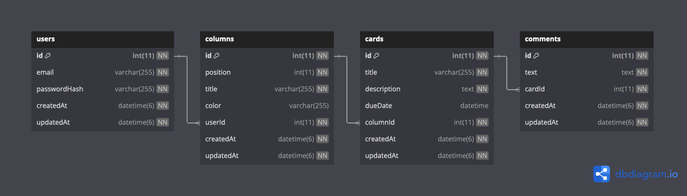

# Тестовое задание Purrweb / backend / стажер / Node.js / NestJS

Задача: разработать упрощенное API сервиса, аналогичного [Trello](https://trello.com/) на [NestJS](https://nestjs.com/).

Исходное задание: [TASK.md](./TASK.md).

## Сопроводительное письмо

В рамках выполнения задания были приняты следующие решения:

1. Поскольку в задании не описано требований к совместной работе, то была использована линейная иерархия сущностей: пользователь - колонка - карточка - комментарий. Соответственно, и проверка доступа осуществляется по данной цепочке.
2. Guard для разных сущностей целенаправленно сделаны отдельными для большей гибкости. Это дает большее кол-во запросов в БД по сравнение с единым guard, где можно было бы использовать объединение таблиц.
3. Guard при проверке доступа также обогащают объект запроса, добавляя туда объекты соответствующих сущностей. Это позволяет в конечных обработчиках вовсе обойтись без запросов к БД.
4. Есть определенная неоднозначность в использовании кодов ответа `403` и `404` из-за вопросов безопасности. Если отвечать на несуществующий объект кодом `404`, а на существующий, но недоступный текущему пользователю `403`, то это позволит извне определить ИД существующих объектов даже не имея к ним доступа.
5. Использование автоинкементных ИД - это упрощение для тестового задания. В реальном проекте стоило бы использовать случайные ИД как минимум для внешнего API. Это позволит не только исключить угадывание ИД, но и оценку внешним наблюдателем кол-ва сущностей в БД проекта.
6. Поскольку заданием не предусмотрены какие-либо роли пользователей, то все пользователи имеют равные права.
7. Метод `PUT` не реализован для сущностей, поскольку в контексте задачи он равносилен `PATCH` с передачей всех полей.

## Использованные технологии

- NestJS
- TypeORM
- Passport.js
- MySQL/MariaDB

## Структура БД



## Настройки

Настройка проекта осуществляется с помощью переменных окружения:

| Переменная       | Назначение                                   | По умолчанию  |
| ---------------- | -------------------------------------------- | ------------- |
| `NODE_ENV`       | Режим работы, `production` или `development` | `development` |
| `DB_HOST`        | Адрес БД                                     | `localhost`   |
| `DB_PORT`        | Порт БД                                      | `3306`        |
| `DB_USERNAME`    | Имя пользователя БД                          | `trello`      |
| `DB_PASSWORD`    | Пароль БД                                    | `trello`      |
| `DB_NAME`        | Название БД                                  | `trello`      |
| `JWT_SECRET`     | Секретный ключ JWT                           | `secret`      |
| `JWT_EXPIRES_IN` | Продолжительность действия JWT               | `1d`          |

**ВНИМАНИЕ!** Значение `NODE_ENV` определяем логику работы со структурой БД. При значении, отличном от `production`, происходит автоматическая синхронизация структуры БД. При значении `production` используются предварительно созданные миграции.

## Запуск

### Разработка

В этом режиме выполняется автоматическая синхронизация структуры БД средствами TypeORM.

```shell
npm i
npm run start:dev
```

### Docker

В этом случае используются предварительно созданные миграции, они запускаются автоматически средствами TypeORM при каждом запуске приложения.

```shell
docker-compose up -d
```

## Лицензия

[Apache License, Version 2.0](./LICENSE)
